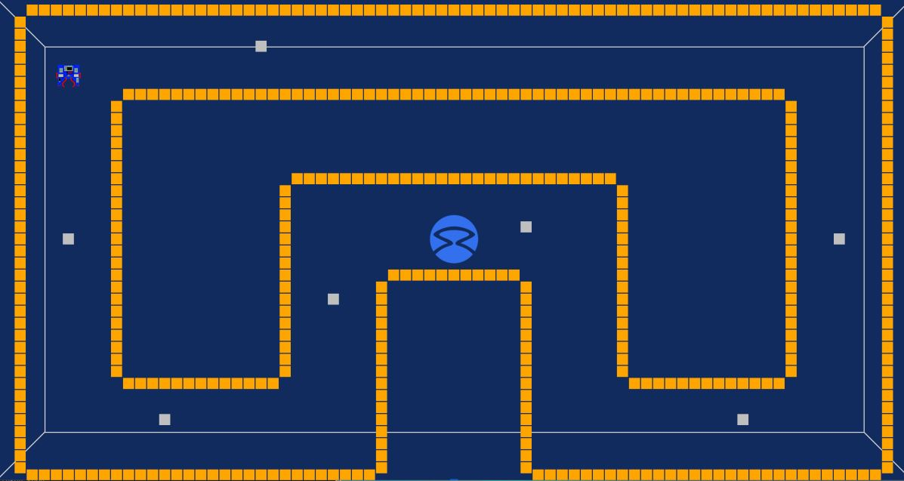
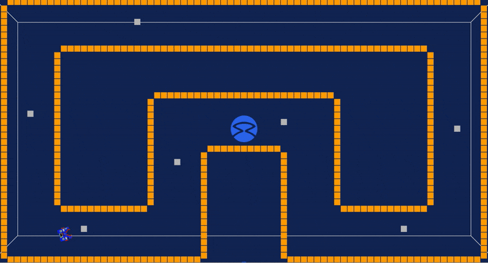

[Research Track I](https://corsi.unige.it/en/off.f/2021/ins/51201)<br>
**Programmer:** [Ankur Kohli](https://github.com/ankurkohli007)<br>
[M.Sc Robotics Engineering](https://corsi.unige.it/corsi/10635)<br>
[University of Genoa (UniGe), Italy](https://unige.it/en)<br>
**Supervisor:** [Prof. Carmine Tommaso Recchiuto](https://rubrica.unige.it/personale/UkNDWV1r)

# Assignment 1

***Python Robotics Simulator: This is a simple, portable robot simulator. The objective of this assignemt is to develop a Python code script which is capable to behave correctly inside of a given environment. Additionally, this simulator is developed by [Student Robotics](https://studentrobotics.org/)***

## ABSTRACT

The assignment is based on Pyhton language. Python laguage is an interpreted high-level programming language which is also a general purporsoe programming approach. In this assignment, code is designed to drive an autonomous robot in a given path. A robot is equiped with sensors which can detect boxes around all directions. When robot driving is initiated then robot needs to detect the silver and gold boxes. As the silver box detected in the robot driving path than robot grab that box and place that box to clear it's moving lane and move ahead. If there will be any golden box or boxes detected in the robot moving path than it avoids those box or boxes and find the clear lane to complete journey. In this code there some functions used such as R. see (), R. grab (), R. release (), and so on to perform different functions. 

## INTRODUCTION

This assignment is based on Python script for achieving the behaviour of robot. This robot continously drive around the arena in the counter-clockwise (CCW) direction which avoid touching of the golden box. Also, when the robot is close to the silver box or silver box detected in the robot moving path than it should grab that box and move it behind itself. 

## PROBLEM TO SOLVE

The robot environment for this assignment is the following arena: 

 

<p align="center">
    <em>Robot Environment</em>
</p>

The robot should:
* move in the circuit in the counter-clockwise direction 
* avoid touching the walls (golden blocks)
* when it finds a silver block on its road, it grabs it and moves it behind itself

## REASON TO SOLVE THE PROBLEM

First, the robot has to avoid collisions with the walls.
So the robot has to drive until it's too close to a wall.
If this wall is on the left it has to turn right, if this is on the right it has to turn left.
How can the robot distinguish a wall on the right from a wall on the left?
The first idea is to consider the angle of the nearest golden block, but the robot often takes the wrong direction! In the figure, the nearest golden token in front of the robot is on the right, so the robot will turn left, then it will find another wall, it will continue to turn left until it will come back. So the first requisite wouldn't be satisfied! 

<p align="center">
  
</p>

<p align="center">
    <em>Nearest Golden Token</em>
</p>

So, to improve the algorithm, the robot doesn't control the angle of the wall in front of it, but checks the distances of the wall on the left and the wall on the right. It turns in the direction of the furthest wall. So it makes the curve in the right way. In the figure, the robot finds a closer wall on the left, so it decides to turn right, that's the right direction.

## METHODOLOGY

This section will describe the methodology of the assignment such as behaviour of the robot, different functions used, and so on for achieving the goal. Firstly, pyhton code is developed to define the robot behaviour in a given environment. To detect silver box find_silver_box() is defined and for golden box find_gold_box() is defined. There are enourmous tasks performed by the robot to tour the complete path are as follows: 

## 1. Robot's drive()

This function is to **DRIVE** the robot in the path. To initiate robot motion drive() is defined. There are two motors variable m0 and m1 being declared. When the direction of m0 and m1 should be same. The amount of speed is given to starts the motor in forward (+) or reverse (-) directions. Below is the code shows the `drive` of the robot:

```python
    def drive(spd, sec):            
    R.motors[0].m0.power = spd
    R.motors[0].m1.power = spd
    time.sleep(sec)
    R.motors[0].m0.power = 0
    R.motors[0].m1.power = 0
```

## 2. Robot's turn()

This function is to **TURN** the robot while moving in the arena. To initiate robot motion turn() is defined. When the same speed is given to motors but with different directions the robot turns. Below is the code shows the `turn` of the robot:

```python
    def turn(spd, sec):
    R.motors[0].m0.power = spd
    R.motors[0].m1.power = -spd
    time.sleep(sec)
    R.motors[0].m0.power = 0
    R.motors[0].m1.power = 0
```

## 3. Robot's find_silver_box()

This function is used to recognise the silvcer box. In this two arguments **'a'** & **'w'** which stands for angle between the robot and box & width for the visual field, respectively. R.see() is also called in this function which detects the obstacle on robot's path. Two variables dist and rot_y is declared, which detects the distance and position of the silver box. The value of token.dist compares with the value of dist to check the distance between the robot and the silver box. Also, it checks the type of the whether it is silver or gold and robot moves in the direction towards the silver box if it is in allign with the silver then grabs the silver box. If it returns (-1, -1) it means no silver box is detected on robot's path. Below is the code shows the `find_silver_box` of the robot:

```python
    def find_silver_box(a, w):
#two arguments a (angle between the robot & box) & w (width for the visual field) is passed
	dist = 100
	for token in R.see():
	    if token.dist < dist and token.info.marker_type == MARKER_TOKEN_SILVER and (a-w) <= token.rot_y <= (a + w):                 
#checking the closest silver box
	       dist = token.dist
	       #nearest silver box distance
	       rot_y = token.rot_y 
	       #angle between the robot and silver box
        if dist == 100:
               return -1, -1    #(-1,-1) when no silver box is detected in the robot's path
        else:
             return dist, rot_y
```

## 4. Robot's find_gold_box()

This function is used to recognise the golden box or wall. In this two arguments **'a'** & **'w'** which stands for angle between the robot and box & width for the visual field, respectively. R.see() is also called in this function which detects the obstacle on robot's path. Two variables dist and rot_y is declared, which detects the distance and position of the golden box or wall. The value of token.dist compares with the value of dist to check the distance between the robot and the golden box or wall. Also, it checks the type of the whether it is silver or gold box. If it returns (-1, -1) it means no golden box or wall is detected on robot's path. Below is the code shows the `find_gold_box` of the robot:

```python
    def find_gold_box(a, w):
#two arguments a (angle between the robot box) & w (width for the visual field) is passed
	dist = 100
	for token in R.see():
	    if token.dist < dist and token.info.marker_type == MARKER_TOKEN_GOLD and (a-w) <= token.rot_y <= (a + w):                   #checking the closest silver box
	       dist = token.dist            #nearest silver box distance
	       rot_y = token.rot_y          #angle between the robot and silver box
        if dist == 100:
               return -1, -1    #(-1,-1) when no gold box is detected in the robot's path
        else:
             return dist, rot_y 
```

## 5. Robot's avoid golden()

This function robot will avoid the golden wall (which is the significance part of the robot's task). Also, robot look for the left and right side to avoid the collision with the golden wall. When the robot finds which side is better than it turns to that particulr side. It also gives priority to right side as robot detected right side is far away from collision with golden box or wall. Below is the code shows the `avoid_golden` of the robot:

```python
    def avoid_golden():
#in this function robot will avoid the golden wall (which is the significance part of the robot's task). Also, robot look for the left and right side to avoid the collision with the golden wall. When the robot finds which side is better than it turns to that particulr side.  
	dist, rot_y = find_gold_box(0, 60)
	
	if dist == -1:
	       return  
	       
	if dist < l_thg:
	    print("Ahh!! Golden Wall or Box on my (robot's) way")
	    right = right_primacy()    #giving priority to right side as robot detected right side is far away from collision with golden box or wall
	    
	    if right:
	        while(dist<c_th):
	    	   turn(15,0.1)
	    	   print("Turning to right side as right is best side to avoid collision")
	    	   dist, rot_y = find_gold_box(0,15)
	    else:
	        while(dist<c_th):
	    	   turn(-15,0.1)
	    	   print("Turning to left side as left is best side to avoid collision")
	    	   dist, rot_y = find_gold_box(0,15)
```

## 6. Robot's right_primacy()

It is defined to check the distance between the robot and the golden wall or box to avoid collision. In this function it compares distance on the left and right side to avoid collision. Below is the code shows the `right_primacy` of the robot:

```python
    def right_primacy():
   
    dist_r, rot_yr = find_gold_box(90, 10)
    print("Distance on the right =", str(dist_r))
    dist_l, rot_yl = find_gold_box(-90, 10)
    print("Distance on the left =", str(dist_l))
    
    if dist_l < dist_r:           #comparing distance on the left and right side to avoid collision
       return True
       
    else:
       return False
```

## 7. Robot's grab_silver_box()

This is defined to detect the silver box, grab it, move behind itseld, and move ahead. When it finds the silver box and robot needs to grab the box. R.grab() is called to grab the Silver Box and it turns to the right side. R.release() is called to release the grabbed silver box and last but not the least robot turns left after move behind & release the silver box. Robot also check the alignment for the silver box such as if the robot is aligned with silver box than it moves ahead and grab it or else it align itself to grab. Below is the code shows the `grab_silver_box` of the robot:

```python
    def grab_silver_box():

    dist, rot_y = find_silver_box(0,70)
    if dist == -1:      #-1 if no silver box detected on robot's path
           print("Ohh!! No silver box found till yet!!")
           return
    dist_gold, rot_ygold = find_gold_box(rot_y, 35)
    
    if dist_gold < dist:
    		  return
    while True:
       dist, rot_y = find_silver_box(0,90)
       if dist < l_th:
              print("Ahh!! Silver Box!! Grab it!!")
              R.grab()        #R.grab() called to grab the Silver Box
              print("Turning Right side to release the silver box")
              turn(35,1)      #turning right
              R.release()     #R.release() called to release the grabbed silver box
              turn(-35,1)     #turning left after moving behind & releasing the silver box
              return
       elif -o_th <= rot_y <= o_th:   #if the robot is aligned with silver box than it moves ahead and grab it or else it align itself to grab
               print("Moving ahead towards silver box")
               drive(40, 1)
       elif rot_y < -o_th:
       #for right
            print("Realligning to Right")
            turn(-1, 0.5)
       elif rot_y > o_th:
       #for left
            print("Realligning to Left")
            turn(1, 0.5) 
       return

while 1:   
	 drive(40,0.1)
	 avoid_golden() 
	 grab_silver_box() 
```

## GRABBING OF SILVER TOKEN

<p align="center">
  
</p>

<p align="center">
    <em>Grabbing Silver Token</em>
</p>

Above *gif* shows the grabbing of silver tokens.

## INSTALLING & RUNNING

The simulator requires a Python 2.7 installation, the [pygame](http://pygame.org/) library, [PyPyBox2D](https://pypi.python.org/pypi/pypybox2d/2.1-r331), and [PyYAML](https://pypi.python.org/pypi/PyYAML/).

Once the dependencies are installed, simply run the new_assignment1.py script with the following bash command:

```bash
$ python run.py RTassignment1.py
```

## TROUBLESHOOTING

When running `python run.py <file>`, you may be presented with an error: `ImportError: No module named 'robot'`. This may be due to a conflict between sr.tools and sr.robot. To resolve, symlink simulator/sr/robot to the location of sr.tools.

On Ubuntu, this can be accomplished by:

* Find the location of srtools: `pip show sr.tools`
* Get the location. In my case this was `/usr/local/lib/python2.7/dist-packages`
* Create symlink: `ln -s path/to/simulator/sr/robot /usr/local/lib/python2.7/dist-packages/sr/`

## FLOW CHART OF THE TASK


<p align="center">
    <em>Flow Chart</em>
</p>

Figure above shows the *Flow Chart* of the task.


## ROBOT PERFORMANCE IN THE GIVEN ENVRIONMENT 



Above *gif* shows the Robot Performnace in the given environment.

## CONCLUSION & IMPROVEMENTS

The robot changes direction when it faces a wall (golden tokens). So when robot is moving in the simulator and putting Silver token behind itself there could be condition when the robot places a token which is very closed to the wall and this will stop robot from collecting the Silver token because the Silver token would be in the threshold we have given to the robot so it dosen't collide with the wall.

